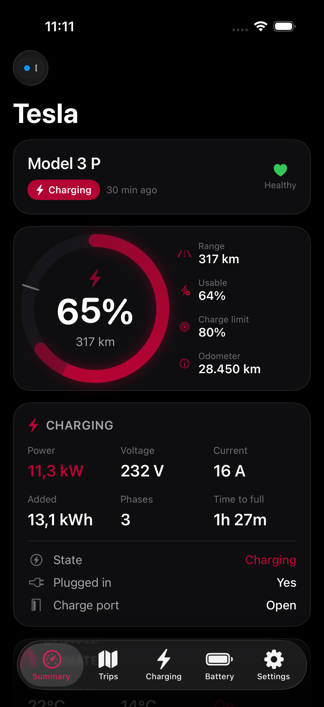
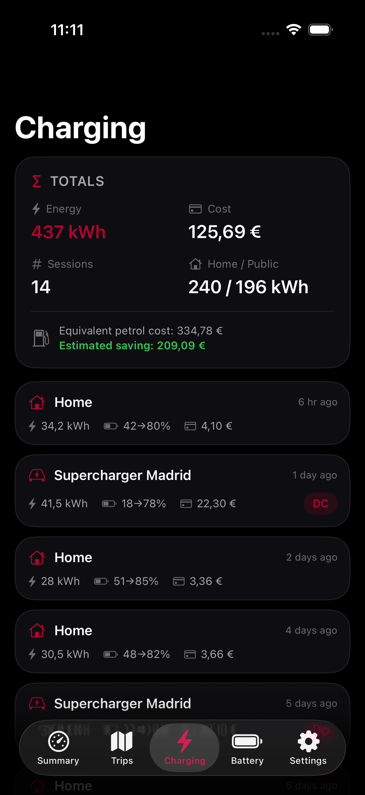
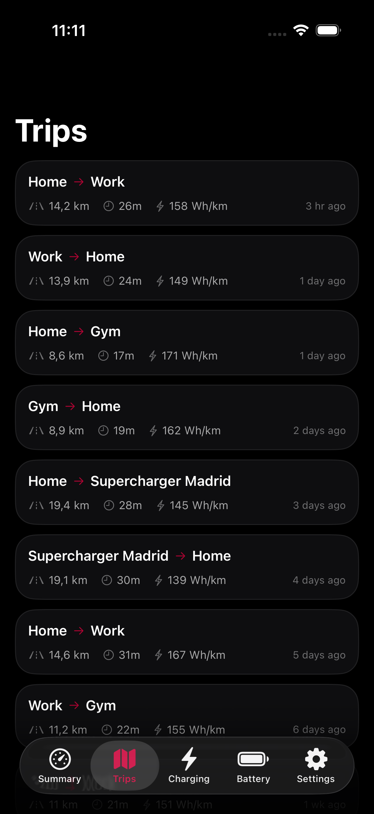
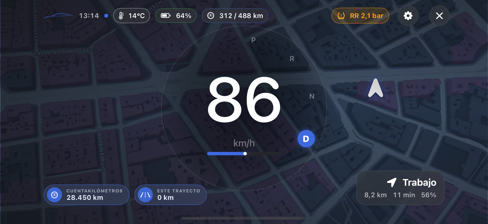

# Tesstats

**Your Tesla data, in one place. Powered by your own TeslaMate server.**

Live vehicle status, trips, charging costs, battery insights and a customisable cockpit-style Driver Display. Tesstats is a **read-only monitoring app**: it does not unlock, start, charge or otherwise control your car.

<p align="center">
  <a href="https://testflight.apple.com/join/pc7ywfgu"><strong>Join the free TestFlight beta</strong></a>
  · <a href="https://drakonis96.github.io/tesstats/">Website</a>
  · <a href="https://github.com/Drakonis96/tesstats-support/issues/new/choose">Get support</a>
</p>

<p align="center">
  
  
  
</p>

<p align="center">
  
</p>

This is the **public documentation and support repository**. It contains user guides and screenshots, not the private application source code. Screenshots illustrate the interface; your layout and available data may differ by build and configuration.

## Contents

- [Try Tesstats](#try-tesstats)
- [What you can do](#what-you-can-do)
- [What you need](#what-you-need)
- [How it works](#how-it-works)
- [Connect your own car](#connect-your-own-car)
- [Make it yours](#make-it-yours)
- [Charging prices and exports](#charging-prices-and-exports)
- [Notifications, Live Activities and Apple Watch](#notifications-live-activities-and-apple-watch)
- [Privacy and driving safety](#privacy-and-driving-safety)
- [Guides and support](#guides-and-support)

## Try Tesstats

### Install the public beta

1. On your iPhone or iPad, install **TestFlight**, Apple's beta-testing app, from the App Store.
2. Open the [Tesstats invitation](https://testflight.apple.com/join/pc7ywfgu) on that device.
3. Accept the invitation and tap **Install** in TestFlight.
4. Open Tesstats. Choose **Explore demo mode** to look around, or configure your own server using the steps below.
5. Return to TestFlight for available updates and release notes. You can enable automatic updates there.

**The beta is free to try.** Your own server, connectivity or hosting may have costs. TestFlight is a beta distribution channel, not an App Store release; availability and supported devices are shown on the invitation. Do not use old private-repository IPA/DMG links as an installation method.

### Explore without a server

Choose **Explore demo mode** during onboarding. You can also toggle **Demo mode** in **Settings → Info**. Demo mode uses sample vehicle data: it does not show your car or prove that a real connection works. Maps may still use network services.

When ready to connect your car, turn demo mode off, enter your connection settings, then save. You do not need to pair Bluetooth to use the normal TeslaMate features.

## What you can do

| Area | What it provides |
|---|---|
| **Summary** | Battery, available range, vehicle state, map, climate, security indicators and recent activity. |
| **Driver Display** | A portrait/landscape cockpit with large speed, gear, battery, range, a following map and optional trip, cost and temperature readouts. Day/night toggle, zoom controls and individual visibility switches. |
| **Trips** | Recorded journeys, routes, distance, duration and available consumption data; local Work/Personal tags and exports. |
| **Charging** | Sessions, locations, energy, estimated or recorded costs, AC/DC breakdown and charge curves when samples are available. |
| **Monthly charging costs** | Monthly bars and a period total, with searchable multi-location selection and day, month or year ranges. |
| **Battery and statistics** | Estimated capacity, degradation, full-charge range and historical trends. These are not official battery diagnostics. |
| **Apple integrations** | Widgets, charging Live Activities and an Apple Watch companion, subject to platform/build availability and background-update limits. |
| **Personalisation** | Accent colour, appearance, units, English/Spanish, configurable cards, multiple vehicles and encrypted configuration backups. |

See the [feature guide](docs/FEATURES.md) for everyday use. Missing source data is not a zero reading, and not every vehicle exposes every field.

## What you need

For demo mode, only a compatible device and the app are needed. For your own vehicle:

- **iPhone/iPad:** iOS/iPadOS 18 or later, subject to the current TestFlight build's requirements. The project also supports macOS 15+, but this page does not offer a separate public Mac installer.
- **TeslaMate already collecting data** from your Tesla on a server that stays on.
- **A reachable MQTT broker** for live values, using MQTT over TLS or secure WebSockets.
- **TeslaMateApi**, strongly recommended for trip/charging history and historical analytics. This is separate from TeslaMate's web interface and Grafana.
- **Network access from your device to that server**, including a VPN or a properly secured remote endpoint when away from home.

You do not enter your Tesla account password into Tesstats. The normal TeslaMate connection does not require a separate Tesla developer account or Fleet API key for Tesstats. [Optional direct Bluetooth](docs/DRIVER_DISPLAY.md) has separate compatibility and pairing requirements.

## How it works

```text
Tesla → your TeslaMate installation
          ├─ MQTT broker ────────── live vehicle values → Tesstats
          └─ database → TeslaMateApi ─ history/analytics → Tesstats

Optional in Driver Display:
iPhone location ───────────────────────── location/speed → Tesstats
Nearby compatible Tesla ─ read-only Bluetooth telemetry → Tesstats
```

MQTT and the history API serve different purposes. A working live dashboard does not mean history is configured, and a working history API does not mean live MQTT is connected. TeslaMate update frequency, vehicle sleep and network conditions affect freshness.

## Connect your own car

The following is the app-side walkthrough. If you have not prepared your server yet, follow the [complete setup guide](docs/SETUP.md) first; it includes a worked secure-WebSocket/reverse-proxy example and verification steps.

### 1. Check TeslaMate

Open your existing TeslaMate installation and confirm the correct car appears and recent journeys/charges are recorded. If TeslaMate itself is not receiving data, resolve that first. New installations start collecting history from their setup date; Tesstats cannot invent older journeys.

### 2. Collect the connection details

Have your MQTT hostname, secure port, transport, broker username/password and history API URL ready. If a reverse proxy uses Basic Auth, collect those **separate** credentials too. Never use your Tesla account password for these fields.

### 3. Enter Settings → Server

Example for a server configured with secure WebSockets and an HTTPS API:

| Tesstats field | Example | Important detail |
|---|---|---|
| Server | `tesla.example.com` | Your server's address, not a Tesla account. |
| MQTT host (name only) | `tesla.example.com` | No `https://`, port or path here. |
| Port | `443` | The external secure WebSocket port. Native MQTT/TLS commonly uses `8883`. |
| Transport | Secure WebSocket / `wss` | Must match your server; do not point native MQTT at an HTTP proxy. |
| WebSocket path | `/mqtt` | Exactly the route configured by your proxy. |
| MQTT username/password | Your broker credentials | Not the reverse-proxy credentials. |
| Topic namespace | Leave empty by default | Only enter your custom namespace, not `teslamate/cars/#`. |
| TeslaMateApi base URL | `https://tesla.example.com/api` | Include scheme and `/api`; do not append `/v1/cars`. |
| My server uses Basic Auth | On only if configured | Enter the proxy username/password, not a Bearer token. |
| Security & certificates | Keep defaults | A valid trusted certificate should not need exceptions. |

Replace all example addresses with your own. This table does not create the server endpoints for you.

### 4. Test both connections

Tap **Test connection**. For MQTT, expect accepted credentials and a received TeslaMate topic. For the API, expect the car list to be found. An absent optional API is different from a failed MQTT connection.

If the broker connects but no topics arrive, check the namespace and broker permissions. If the API returns HTML, you probably entered the TeslaMate/Grafana website rather than the API. Use the [troubleshooting guide](docs/TROUBLESHOOTING.md) before weakening certificate validation.

### 5. Save and select your vehicle

Tap **Save & Connect** during onboarding, or **Save** in Settings. Select the correct car in the vehicle selector; the **Vehicles** section is also available under **Settings → Info**. Check Summary, then open Trips and Charging to confirm both data paths work. Allow the first history load to finish.

### 6. Verify access away from home

While parked, disable Wi-Fi and test using mobile data. If you use a VPN, connect it first. A home-only IP will not work from mobile data without a route back to your network. Do not solve this by exposing PostgreSQL or anonymous MQTT to the Internet.

## Make it yours

1. Open **Settings → Prefs** to choose units, currency, language and appearance.
2. Use the **four-square layout button** on supported sections to show, hide or reorder their cards.
3. Open **Driver Display** while parked. Its own settings let you choose the telemetry source, speed adjustment and visible elements; the layout button provides in-display customisation.
4. Use the day/night button to change the driving appearance and the `+` / `−` buttons to adjust the map zoom.
5. If desired, pair a compatible vehicle from Driver Display settings. Pairing is per vehicle and separate from the car's audio Bluetooth connection.

The optional iPhone GPS speed adjustment defaults to **+2 km/h** and can be disabled or changed from **−10 to +10 km/h**. It changes the displayed iPhone GPS speed only, not Bluetooth or TeslaMate speed. See the [Driver Display guide](docs/DRIVER_DISPLAY.md).

## Charging prices and exports

1. Set your **currency and default electricity price per kWh** in Settings → Prefs.
2. For a specific charging location, use **Add price** on an unpriced charging row. Enter a **price per kWh**, not the session total. Enter `0` for a free location.
3. If you use time-of-use pricing, configure a tariff plan and enable/select it in Prefs.
4. In Charging, open **Monthly charging cost** to select places and a date/month/year interval. Its filters are independent of the main session list.
5. To export, filter the **charging session list**, tap its share/export button and choose CSV, JSON or GPX.

Costs depend on available records and pricing precedence. Tariff estimates are not supplier invoices; a recorded cost can take precedence over your location/default rate. The [charging and costs guide](docs/CHARGING.md) explains this with examples, and [export details](docs/CHARGING_EXPORTS.md) describe the included fields and limitations.

## Notifications, Live Activities and Apple Watch

These features do **not** imply an always-running background connection:

- Allow notifications in iOS Settings and enable the wanted categories in **Tesstats Settings → Alerts**.
- Local alerts need Tesstats to receive data. iOS can suspend the app, stopping continuous local MQTT monitoring.
- Background vehicle alerts and Live Activity pushes require a compatible, authorised APNs backend. Installing TestFlight alone does not provide one.
- On Apple Watch, install the companion using the iPhone's Watch app if available. Open Tesstats on the iPhone, verify the selected car and connection, then open the watch app. Watch data is not an independent permanent connection to the car.

Read [Notifications and Live Activities](docs/NOTIFICATIONS.md) before enabling **Immediate push**. Do not purchase an Apple developer account or upload APNs credentials just to test this beta.

## Privacy and driving safety

- Tesstats monitors; it does not expose vehicle-control actions. Treat security indicators as status readouts, not lock/climate controls.
- Connection passwords are stored in Apple Keychain. Backups and exports can contain sensitive information: keep them private.
- Standard connections use your configured infrastructure. Optional push delivery involves your configured backend and Apple APNs; maps use Apple services.
- Leave certificate validation enabled. The custom-certificate switch is **not** automatic verification of a particular server; see [security details](docs/PRIVACY_AND_SECURITY.md).
- Configure Driver Display **while parked**. It is a supplemental display, not a replacement for the vehicle's instruments, safety warnings or navigation. Readings can be delayed or unavailable.

## Guides and support

| Guide | What it explains |
|---|---|
| [Setup](docs/SETUP.md) | Server prerequisites, MQTT, HTTPS API, proxy example, app fields and connection checks. |
| [Features](docs/FEATURES.md) | Main sections, customisation, Apple Watch and backups. |
| [Driver Display](docs/DRIVER_DISPLAY.md) | Controls, source selection, pairing/removal and GPS speed adjustment. |
| [Charging and costs](docs/CHARGING.md) | Free charging, tariffs, monthly filters and interpreting costs. |
| [Charging exports](docs/CHARGING_EXPORTS.md) | CSV/JSON/GPX contents, pricing metadata and estimates. |
| [Notifications](docs/NOTIFICATIONS.md) | Permissions, background limits, Sentry signals and push requirements. |
| [Privacy and security](docs/PRIVACY_AND_SECURITY.md) | Connections, certificates, credentials and safe reporting. |
| [Troubleshooting](docs/TROUBLESHOOTING.md) | Common symptoms, checks and what to include in a report. |

Search [existing issues](https://github.com/Drakonis96/tesstats-support/issues) first, then [open a support request](https://github.com/Drakonis96/tesstats-support/issues/new/choose). Include app version/build, device/OS, connection type, exact steps, expected/actual behaviour and a redacted screenshot if useful. Do not post passwords, tokens, VINs, private server addresses or identifiable map locations.

Tesstats is independent and is not affiliated with, endorsed by or sponsored by Tesla, Inc. or the TeslaMate project. Their names are used to describe compatibility.
